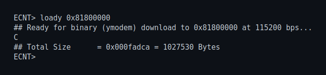
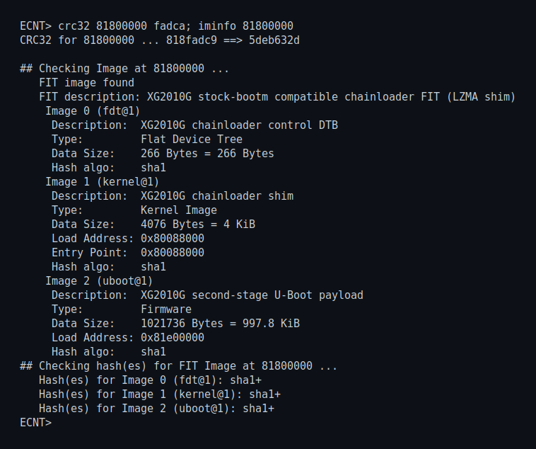
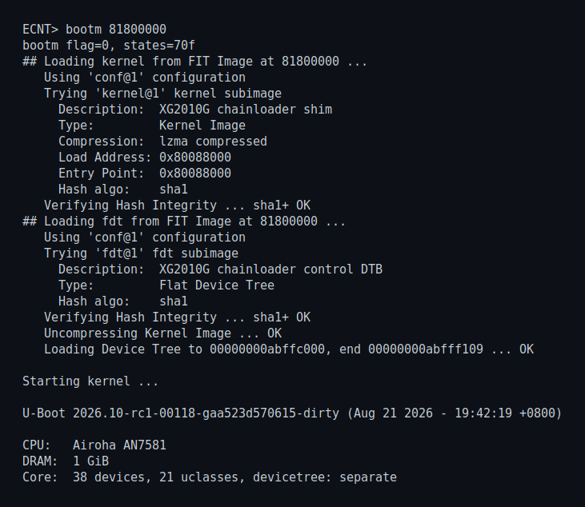
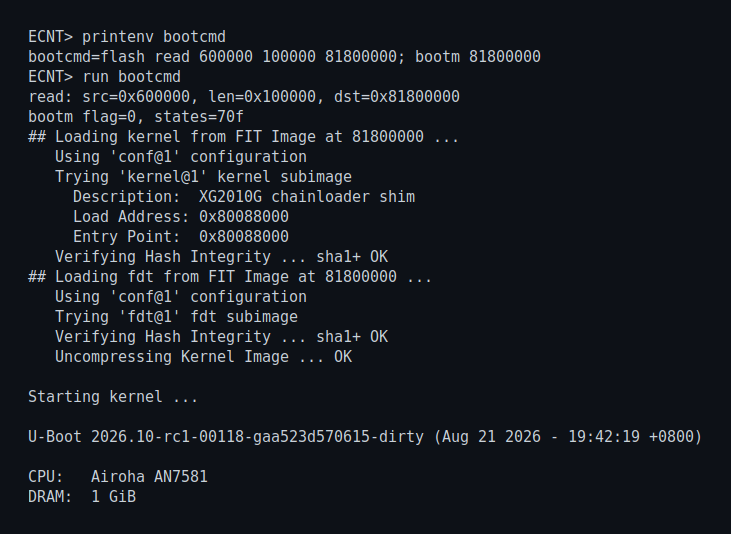

# XG2010G U-Boot

This tree contains the customized second-stage U-Boot chainloader for the
XG2010G. The vendor ECNT/AXON U-Boot remains the first stage and loads a bare
FIT from the dedicated 1 MiB window at SPI-NAND `0x600000..0x700000`. This
project does not replace the vendor U-Boot, FIP, BL31, or secure-boot
certificates.

## Current Build

The current verified artifact is:

```text
../chainloader/xg2010g-chainloader-web-final.itb
size:   1027530 bytes (0xfadca)
sha256: c97c50b139277b507772b85210d4d3fdaff5ada998d3b814c5088963cab94b7d
```

Build a candidate with:

```sh
cd ../chainloader
./build-web.sh xg2010g-chainloader-candidate.itb
```

The output must remain a bare FIT with magic `d00dfeed` at offset 0 and must
not exceed 1 MiB. Do not flash `u-boot.bin` or `u-boot.img` directly. Routine
updates use the second-stage HTTP Recovery U-Boot target at
`http://192.168.255.1/`; they do not require `saveenv`.

## First Installation from Vendor U-Boot

Use a `115200 8N1` serial connection. This procedure keeps the vendor
ECNT/AXON U-Boot in place: it first tests the chainloader entirely from RAM,
then asks the tested second stage to write only the dedicated
`0x600000..0x700000` SPI-NAND window.

> [!WARNING]
> Do not save a new first-stage `bootcmd` until `chainloader_install` reports
> both `installed` and `read-back verified`. Never write `u-boot.bin`,
> `u-boot.img`, FIP, BL31, DSD, ART, BMT, or any address outside the 1 MiB
> chainloader window.

### 1. Load the bare FIT into RAM

Stop vendor autoboot at the `ECNT>` prompt, then start its YModem receiver:

```text
loady 81800000
```

Immediately send `../chainloader/xg2010g-chainloader-web-final.itb` with
YModem. With PortMate, select protocol `YModem` and receiver `load:loady`.
The current image takes about eight minutes at 115200 baud and must finish
with exactly `1027530` bytes:



### 2. Verify and test-boot the RAM copy

Run both checks before booting:

```text
crc32 81800000 fadca
iminfo 81800000
```

The CRC must be `5deb632d`. `iminfo` must identify a FIT and all three images,
`fdt@1`, `kernel@1`, and `uboot@1`, must end in `sha1+`. Stop immediately if
the size, CRC, format, or any hash differs.



Boot the checked RAM image:

```text
bootm 81800000
```

The handoff must reach the current second-stage banner. Press a key during
the second-stage autoboot countdown so it remains at the `U-Boot>` prompt
instead of entering HTTP Recovery.



### 3. Install the running image

At the second-stage `U-Boot>` prompt, enter the confirmation token exactly:

```text
chainloader_install XG2010G_INSTALL
```

The command rechecks the running FIT, erases only the 1 MiB chainloader
window, writes the normalized bare FIT, and reads it back. A successful run
ends with output equivalent to:

```text
Preserved running XG2010G chainloader FIT from 0x81800000 (1027530 bytes)
Installing running chainloader into spi-nand0 0x600000..0x700000
Running chainloader installed and read-back verified (1027530 bytes)
```

Do not continue if any hash check, erase, write, or read-back step fails.

### 4. Configure the vendor first-stage boot command

Reset after the successful install and interrupt vendor autoboot again:

```text
reset
```

At the returned `ECNT>` prompt, set, inspect, and save only `bootcmd`:

```text
setenv bootcmd 'flash read 600000 100000 81800000; bootm 81800000'
printenv bootcmd
saveenv
run bootcmd
```

`run bootcmd` must read exactly 1 MiB from flash offset `0x600000` and reach
the same second-stage banner:



This is the only step that needs `saveenv`, and it is performed once during
the initial migration. On an already migrated unit, first run
`printenv bootcmd`; do not rewrite or save the environment when the value
already matches. Routine chainloader updates use HTTP Recovery or
`chainloader_install` and leave the vendor environment unchanged.

The screenshots above are rendered from the verified PortMate serial log
captured on 2026-08-21; only unrelated verbose lines are omitted.

## Network Ports

The configured port mapping is:

- `lan1`: 10G through RTL8261 PHY5
- `lan2`: PCIe1 path through RTL8261 PHY8; currently verified at 2.5G
- `lan3`: EN8811H through PHY15; initialization currently times out
- `lan4`: 1G through internal switch port4 / PHY12

v43 and later fix LAN4 recovery by using switch mask `0x10` and PHY mask
`0x1000` instead of the old port1/2 and PHY9/10 assumptions. LAN4 DHCP and
HTTP are verified. v46 also maps PHY12 to the active-low green/yellow LAN LEDs
on GPIO46/GPIO42 for speed and activity indication.

The current build keeps errors and explicit `rtl8261_diag` output while
suppressing normal RTL8261 patch progress, PR calibration, fport transition,
and early initialization checkpoint messages.

See [the XG2010G chainloader guide](../chainloader/README.md) for build,
installation, recovery-port selection, TFTP/YModem validation, diagnostics,
and flash safety boundaries.
